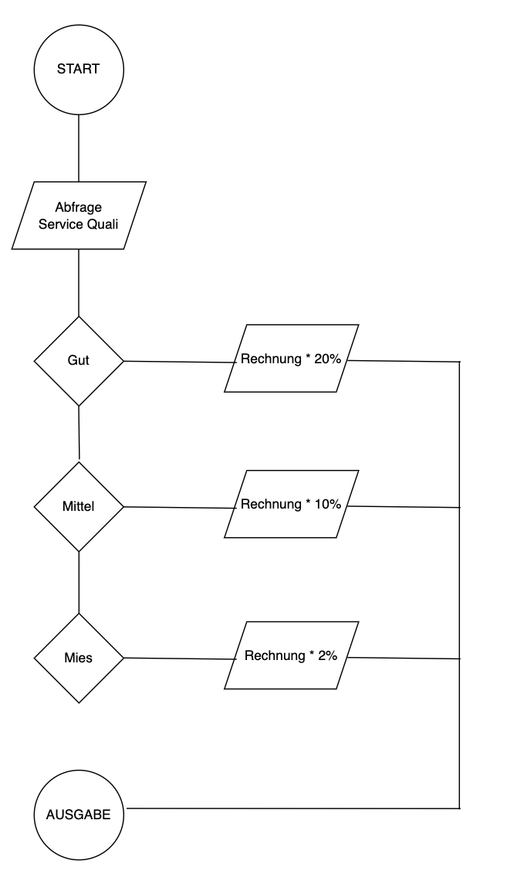

# Project TS-Trinkgeld-Rechner
> Live demo [_here_](https://noctwo.github.io/project-trinkgeld-rechner/).

## Table of Contents
* [General Info](#general-information)
* [Technologies Used](#technologies-used)
* [Features](#features)
* [Screenshots](#screenshots)

## General Information
Project TypeScript Trinkgeld-Rechner
https://supercode.notion.site/Project-TS-Trinkgeldrechner-d37bd545188c44e2b9682bbfbda713b7

## Technologies Used
- HTML5
- CSS3
- TypeScript
- Vite

## Features
- Höhe des Trinkgeldes nach Auswahl der Servicequalität
- Berechnung der Höhe d. Trinkgeldes
- Berechnung des Gesamtpreises
- Berechnung des Preises pro Person

## Screenshots

